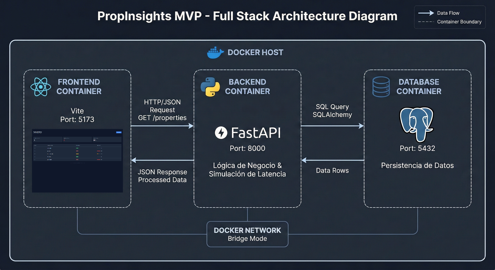

# PropInsights - Sistema de Observabilidad y Disponibilidad de Activos Críticos (MVP)

## 1. Propósito
Plataforma MVP de monitoreo IoT para la gestión de activos inmobiliarios. Centraliza métricas de conectividad y latencia de red para detectar fallos operativos  antes de que afecten a los inquilinos.

## 2. Requisitos
* Docker Desktop v4.0+
* Git

## 3. Ejecución (Quickstart)
Para levantar la infraestructura completa como Base de datos, Backend y Dashboard, ejecuta este comando en la raíz del proyecto:

```bash
docker compose -f infra/docker-compose.yml up --build
```

## Acceso:
* Dashboard: http://localhost:5173
* API Docs: http://localhost:8000/docs

## 4. Cómo replicar la demo
Ejecute el comando de arriba y espere a que aparezca "Application startup complete".

Abra el Dashboard. Verá métricas iniciales simuladas.

Presione el botón "↻ Actualizar Live".

Observe cómo las tarjetas de KPIs  cambian en tiempo real.

Identifique propiedades en estado CRITICAL  que requieren intervención inmediata.

## 5. Limitaciones Conocidas
Persistencia Volátil: Al ser un MVP de arquitectura, los datos históricos se reinician al bajar los contenedores para facilitar la revisión.

Simulación Estocástica: La latencia mostrada es generada algorítmicamente (random.randint) en el backend para demostrar la capacidad de renderizado del frontend sin depender de sensores físicos reales.

Escalabilidad: El frontend renderiza todos los activos en una vista; para >100 activos se requiere paginación... fuera del alcance de este MVP.


## 6. Arquitectura y Trade-offs

## Diagrama de Arquitectura


### 1. Autenticación
* **Decisión:** Se implementó un acceso abierto Open API con configuración CORS permisiva `allow_origins=["*"]`.
* **Trade-off:** Se priorizó la facilidad de prueba para el corrector sobre la seguridad.
* **Mitigación futura:** En producción, se debe implementar **OAuth2 con JWT** y restringir el CORS al dominio del frontend.

### 2. Caché
* **Decisión:** El backend consulta directamente a PostgreSQL en cada petición ("Live Fetch").
* **Trade-off:** Se priorizó la frescura del dato en tiempo real (vital para las alertas críticas) sobre la eficiencia de carga.
* **Mitigación futura:** Para escalar a >10,000 sensores, se debe integrar **Redis** para cachear los metadatos de las propiedades estáticas (nombres, IDs).

### 3. Trazabilidad
* **Decisión:** Los logs se envían a `stdout` para que sean visibles directamente en Docker Desktop.
* **Trade-off:** Simplicidad de depuración inmediata vs. persistencia histórica.
* **Mitigación futura:** Integrar un stack **ELK** para análisis forense de incidentes pasados.

## 7. Créditos
Stack: React (Vite), FastAPI, PostgreSQL, Docker.

Autor: Brian Andres Ramirez Ross.